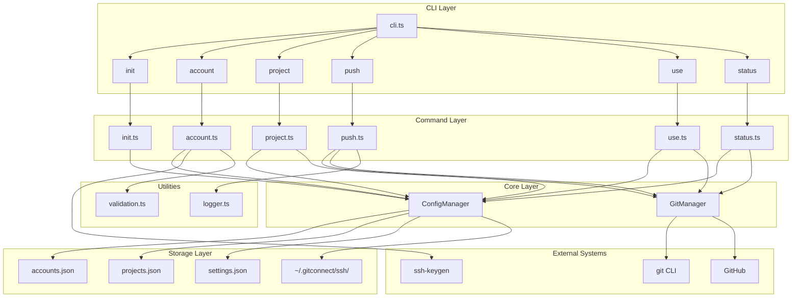
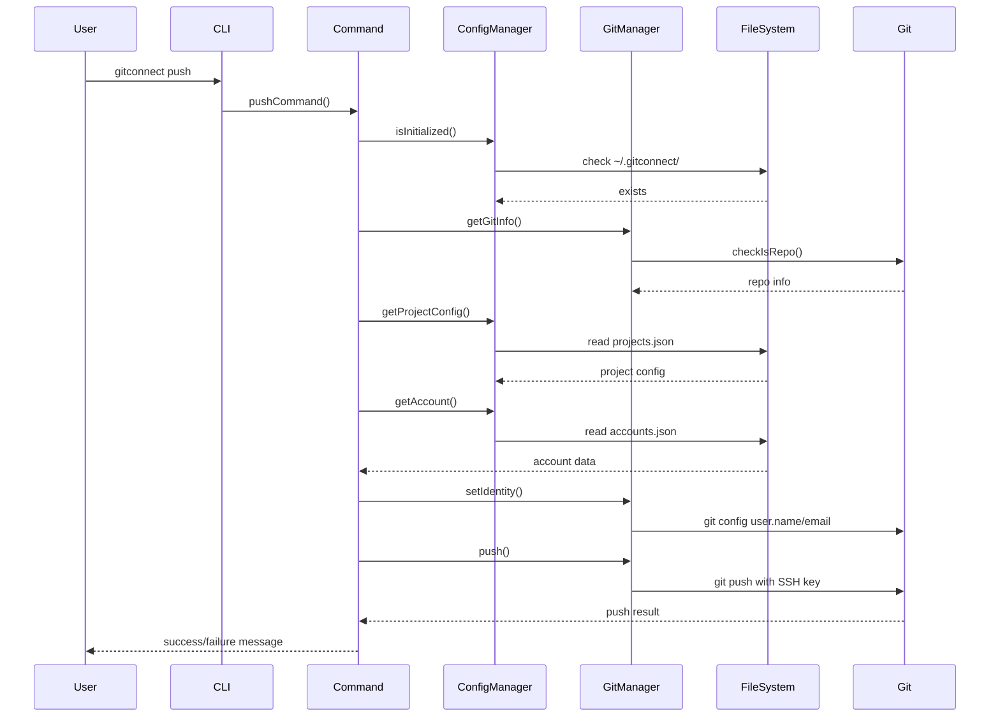
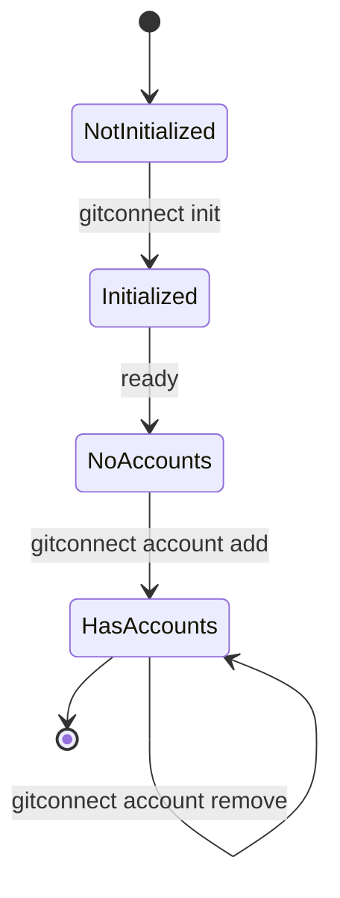
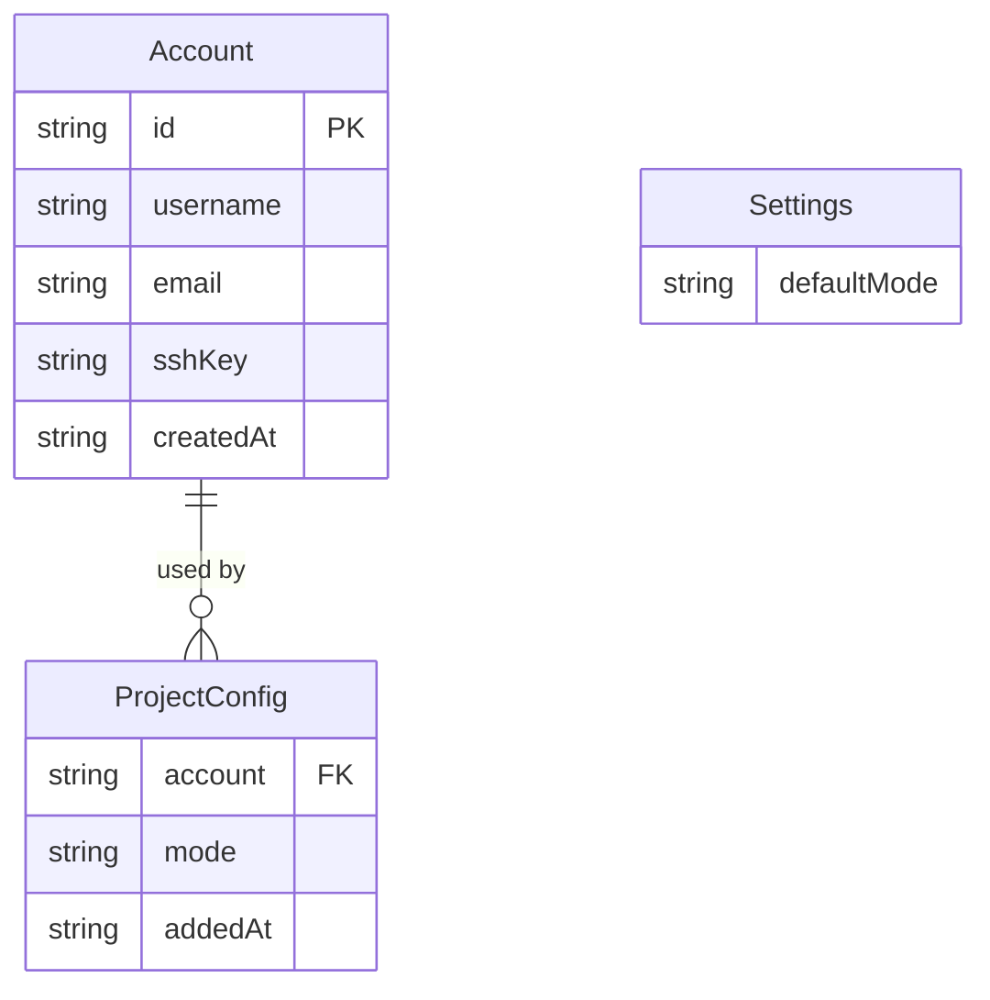
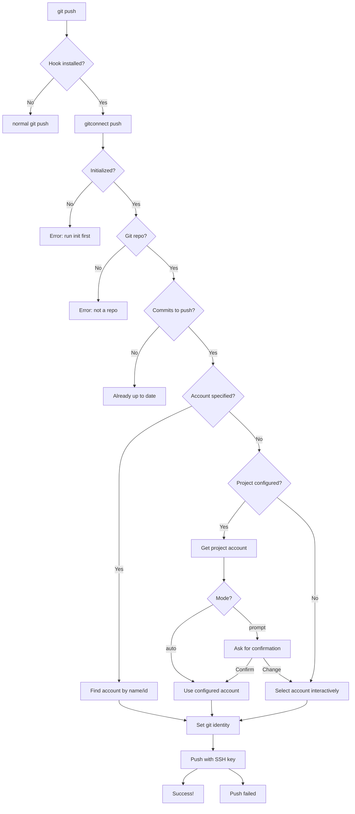
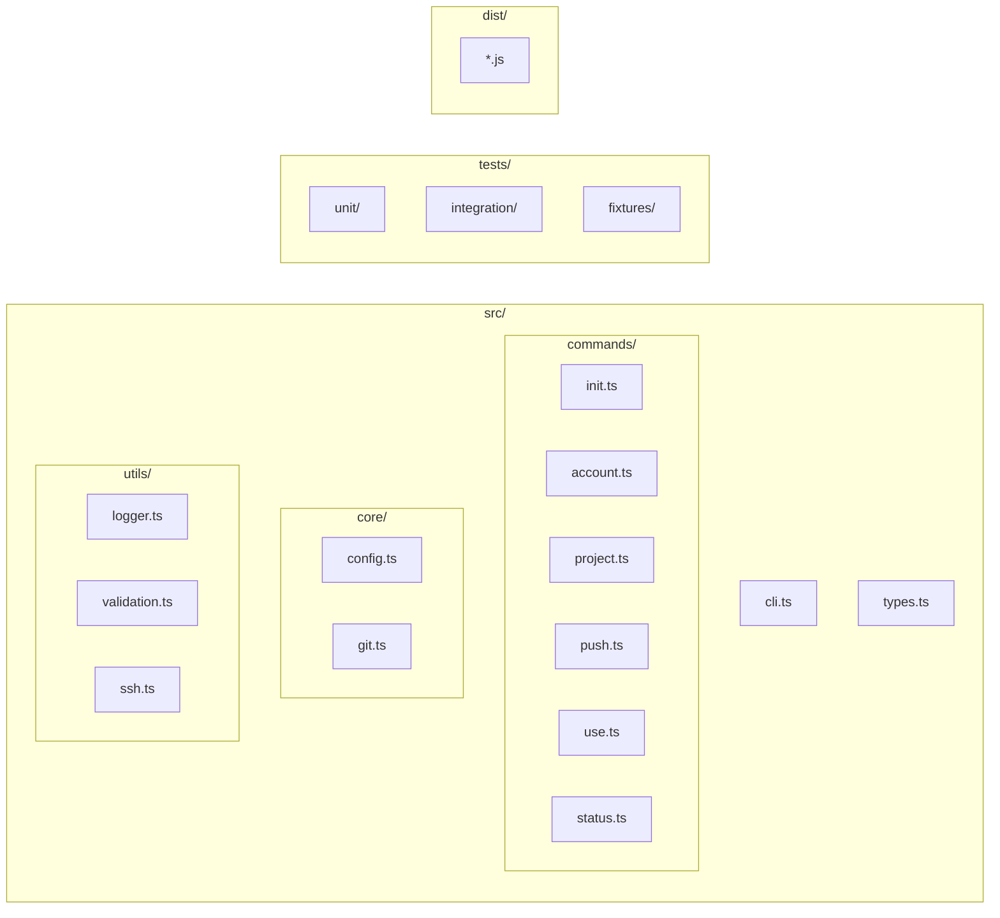

# GitConnect Architecture

## System Overview

```mermaid
graph TB
    subgraph CLI["CLI Layer"]
        CLI_MAIN[cli.ts]
        CLI_MAIN --> CMD_INIT[init]
        CLI_MAIN --> CMD_ACCOUNT[account]
        CLI_MAIN --> CMD_PROJECT[project]
        CLI_MAIN --> CMD_PUSH[push]
        CLI_MAIN --> CMD_USE[use]
        CLI_MAIN --> CMD_STATUS[status]
    end

    subgraph Commands["Command Layer"]
        CMD_INIT --> INIT[init.ts]
        CMD_ACCOUNT --> ACCOUNT[account.ts]
        CMD_PROJECT --> PROJECT[project.ts]
        CMD_PUSH --> PUSH[push.ts]
        CMD_USE --> USE[use.ts]
        CMD_STATUS --> STATUS[status.ts]
    end

    subgraph Core["Core Layer"]
        CONFIG[ConfigManager]
        GIT[GitManager]
        
        INIT --> CONFIG
        ACCOUNT --> CONFIG
        PROJECT --> CONFIG
        PROJECT --> GIT
        PUSH --> CONFIG
        PUSH --> GIT
        USE --> CONFIG
        USE --> GIT
        STATUS --> CONFIG
        STATUS --> GIT
    end

    subgraph Storage["Storage Layer"]
        CONFIG --> ACCOUNTS[accounts.json]
        CONFIG --> PROJECTS[projects.json]
        CONFIG --> SETTINGS[settings.json]
        CONFIG --> SSH_KEYS[~/.gitconnect/ssh/]
    end

    subgraph External["External Systems"]
        GIT --> GIT_CLI[git CLI]
        GIT --> GITHUB[GitHub]
        ACCOUNT --> SSH_KEYGEN[ssh-keygen]
    end

    subgraph Utils["Utilities"]
        LOGGER[logger.ts]
        VALIDATION[validation.ts]
        
        ACCOUNT --> VALIDATION
        PUSH --> LOGGER
    end
```

## Data Flow

```mermaid
sequenceDiagram
    participant User
    participant CLI
    participant Command
    participant ConfigManager
    participant GitManager
    participant FileSystem
    participant Git

    User->>CLI: gitconnect push
    CLI->>Command: pushCommand()
    Command->>ConfigManager: isInitialized()
    ConfigManager->>FileSystem: check ~/.gitconnect/
    FileSystem-->>ConfigManager: exists
    Command->>GitManager: getGitInfo()
    GitManager->>Git: checkIsRepo()
    Git-->>GitManager: repo info
    Command->>ConfigManager: getProjectConfig()
    ConfigManager->>FileSystem: read projects.json
    FileSystem-->>ConfigManager: project config
    Command->>ConfigManager: getAccount()
    ConfigManager->>FileSystem: read accounts.json
    FileSystem-->>Command: account data
    Command->>GitManager: setIdentity()
    GitManager->>Git: git config user.name/email
    Command->>GitManager: push()
    GitManager->>Git: git push with SSH key
    Git-->>Command: push result
    Command-->>User: success/failure message
```

## Account Management Flow

```mermaid
stateDiagram-v2
    [*] --> NotInitialized
    NotInitialized --> Initialized: gitconnect init
    Initialized --> NoAccounts: ready
    NoAccounts --> HasAccounts: gitconnect account add
    HasAccounts --> HasAccounts: gitconnect account add
    HasAccounts --> HasAccounts: gitconnect account remove
    HasAccounts --> [*]
```

## Project Configuration

```mermaid
erDiagram
    Account {
        string id PK
        string username
        string email
        string sshKey
        string createdAt
    }
    
    ProjectConfig {
        string account FK
        string mode
        string addedAt
    }
    
    Settings {
        string defaultMode
    }
    
    Account ||--o{ ProjectConfig: "used by"
```

## Push Decision Tree

```mermaid
flowchart TD
    START[git push] --> CHECK{Hook installed?}
    CHECK -->|No| NORMAL[normal git push]
    CHECK -->|Yes| GC[gitconnect push]
    GC --> INIT{Initialized?}
    INIT -->|No| ERROR[Error: run init first]
    INIT -->|Yes| REPO{Git repo?}
    REPO -->|No| ERROR2[Error: not a repo]
    REPO -->|Yes| CHANGES{Commits to push?}
    CHANGES -->|No| UP_TO_DATE[Already up to date]
    CHANGES -->|Yes| ACCOUNT_OPT{Account specified?}
    ACCOUNT_OPT -->|Yes| FIND_ACCOUNT[Find account by name/id]
    ACCOUNT_OPT -->|No| PROJECT_CONFIG{Project configured?}
    PROJECT_CONFIG -->|Yes| GET_CONFIG[Get project account]
    PROJECT_CONFIG -->|No| SELECT[Select account interactively]
    GET_CONFIG --> MODE{Mode?}
    MODE -->|auto| USE_ACCOUNT[Use configured account]
    MODE -->|prompt| ASK[Ask for confirmation]
    ASK -->|Confirm| USE_ACCOUNT
    ASK -->|Change| SELECT
    FIND_ACCOUNT --> SET_IDENTITY[Set git identity]
    SELECT --> SET_IDENTITY
    USE_ACCOUNT --> SET_IDENTITY
    SET_IDENTITY --> PUSH[Push with SSH key]
    PUSH --> SUCCESS[Success!]
    PUSH --> FAIL[Push failed]
```

## File Structure

```mermaid
graph LR
    subgraph Source["src/"]
        CLI[cli.ts]
        TYPES[types.ts]
        
        subgraph Commands["commands/"]
            INIT[init.ts]
            ACCOUNT[account.ts]
            PROJECT[project.ts]
            PUSH[push.ts]
            USE[use.ts]
            STATUS[status.ts]
        end
        
        subgraph Core["core/"]
            CONFIG[config.ts]
            GIT[git.ts]
        end
        
        subgraph Utils["utils/"]
            LOGGER[logger.ts]
            VALIDATION[validation.ts]
            SSH[ssh.ts]
        end
    end
    
    subgraph Tests["tests/"]
        UNIT[unit/]
        INT[integration/]
        FIX[fixtures/]
    end
    
    subgraph Dist["dist/"]
        COMPILED[*.js]
    end
```